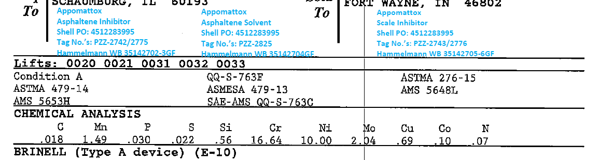
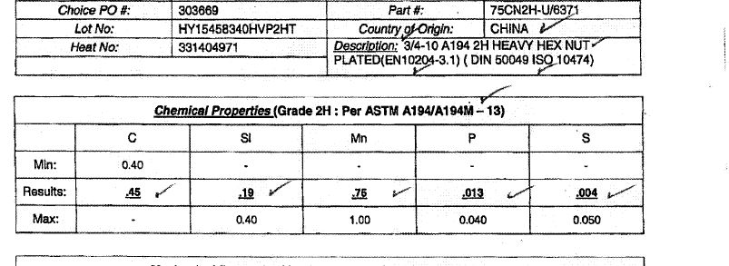

# Mill Test Reports (MTRs) Information Extraction 

The initial attempt at digitalizing MTRs database out of hard copies. 
The ultimate goal is to build comprehensive digital databases out of different scanned forms, and to make materials qualtiy control & examination tasks easier and more efficient for engineers.
*** 

## Prerequisites
OCR:
* [Tesseract-OCR]: Installation guide on Windows could be found [here](https://pypi.org/project/pytesseract/). 
* [pytesseract]
* [PIL]

PDf & Text processing:
* [tabula]
* [PyPDF2]
* [shutil]
* [fuzzywuzzy]
* [re]
* [cv2]

Generic: 
* [Numpy]
* [pandas]
* [csv]
* [json]
* [timeit]

## How it works
* The idea, simply, is to extract the essential content, i.e. chemical analysis, and later all useful contents from MTRs, and organize then into a structured database that can be deployed for multiple purposes.  
* We are utilizing tesseract-OCR (optical character recognition), and then NLP(natural language processing) to build the preliminary database.
* The raw data: scanned MTRs that come in all different formats
  

* The process: 
 1. Define the libraries for sub-vendor location extractions
 2. Split pdfs into single files and convert to text
 3. Based on converted text, fuzzy matching su-vendors. If top quality (class1), extract the content directly using pdf tools to text files, and move the files to top class folder; if not, crop the pdf based on the location information 
 4. Convert the cropped files to text files. Based on quality of content, decide whether to move it to 2nd quality folder or not (stays as the bottom qualty file)
 5. Add 'ID' field with the file name & page information, and 'class' field based on the folder where the file lies.
 6. Parse all files from class 1 to a preliminary database: split, merge, and match columns, get rid of useless column and rows, transpose side-by-side contents, use regular expressions to double-check that the content extracted is chemical analysis.
 7. Export the database to non-coder friendly .csv file
 

## File Organizations
* InformationExtraction: Main folder 
  1. code: python files 
  2. demos: jupyter notebook with all content and corresponding converted html file
  3. dictionaries: defined location dictionaries to extract information from 
  4. output: sequential processed output from the program
* Data: raw data. MTRs from vendors, each file contains multiple pages that are usually multiple MTRs from several sub-vendors who provide materials to the same vendors
* StudyMaterials: project related readings
* PresentationSlides: all touchdown slides
* Experiments: previous explorations, including IBM Watson test, test on old samples etc. that are not included in the final model
* README: this file
* README for non_coders: more detailed documentation in a layman's language 

## To-dos
* Orientation detection
* Class 2 database clean-up
* Ask for experts' inputs when the confidence about extracted content is low

## Acknowledgments
* Special thanks to Deval for guidance along the way
* To Patrick and Xin providing domain expertise
* To Ming providing sights
* And to all rest of people here that make my intership at Shell extra wonderful
* To my friends from Microsoft & IBM for suggestions and ideas

## Authors
* **Ginny Zhu** - *Initial work* - [github profile](https://github.com/chocolocked)
* **Coded by Ginny, with love :)**
